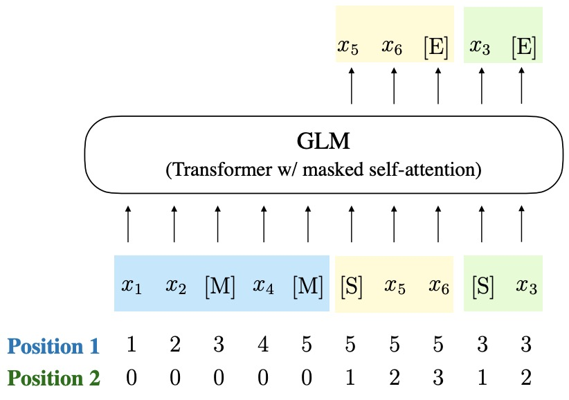

# GLM 完形填空式生成


GLM 自然地处理可变长度的空白填充，这对于许多下游任务至关重要。
基于自回归填空，GLM随机从输入文本中删除连续的标记范围，
遵循自动编码的思想，训练模型重建跨度，遵循自回归的想法预训练。GLM 学习预训练期间的自回归生成。

GLM 对下游任务进行微调，并将它们重新定义为空白填充生成。每个任务都与一个人为的完形填空问题相关联，模型预测答案
到完形填空。
例如，情感分类任务被重新表述为填充“[SENTENCE] 中的空白。  
"它真的  "。 "好"或"坏"的预测表明
情绪是积极的还是消极的。

有了这样的方式，GLM 受益于预训练和训练之间的一致性
微调，因为预训练和微调都涉及训练模型以生成给定上下文的文本。

为了让预训练更适合文本生成任务的方法，GLM 还研究
多任务预训练设置，其中模型是联合的训练以重建蒙面跨度并生成更长的文本。


在 GLM 中，共有三种 MASK 方法，分别对应三种预测格式。
1. ```[MASK]```, 令牌级别。这种屏蔽方法只会屏蔽一个句子中的随机标记，
   在三种遮罩方法中，它的掩码部分最少。所以，生成的内容也有限。例如： ``[CLS]北京故宫是中国[MASK]非物质文化遗产。<|endoftext|><|startofpiece|>现存最大的古代宫殿建筑, 也是``.
2. ```[sMASK]```: 实体级。我们限制遮罩
   spans必须是完整的句子。多个跨度
   （句子）被抽样覆盖 15%
   原始令牌。该目标旨在
   seq2seq 任务，其预测通常是
   完整的句子或段落。
  ```[sMASK]``` 预测结果比 ```[MASK]```更长. 例如: `` [CLS]人工智能是一个以计算机科学为基础,由计算机、数学、哲学等多学科交叉融合的交叉学科,[sMASK],具有非常巨大的前景。<|endoftext|><|startofpiece|>它涉及的信息量不仅非常巨大,而且也是人工智能发展的一个关键,其研究内容包括人的感觉、知觉和思维,以及如何理解各种现象,以及解释现象的本性和原因等,通过计算机来进行系统的分析推理、建立数学模型,并模拟人类意识。``
3. ```[gMASK]```: 文档级别。我们对单个跨度进行采样
   其长度是从原始长度的 50%–100% 上的均匀分布中采样的。
   该目标旨在生成长文本。 For example: ``[CLS]问题:啤酒伤胃吗?回答:[gMASK]<|startofpiece|>谢邀。 我是啤酒爱好者,但是我不喝酒。 我以前也说过,喝酒伤身,啤酒伤胃,伤肠道。 现在我也知道了啤酒伤人的很多细节,我就不瞎几把的说,大家看图片就知道了。 <n><n>其实啤酒伤身这个说法只是表面而已。 <n><n>啤酒中含有少量的碳酸和酒精,碳酸和酒精是成酸性物质,而乙醇是脂溶性的,酒精在胃里能够被分解,生成乙醇和二氧化碳,在体内是水和二氧化碳,两种物质会迅速发生中和反应,结果导致人体出现头痛、呕吐、胸痛、浑身发热等现象,这就是所谓喝大了,喝多了。 <n><n> 啤酒的含糖量在15%左右,喝多了也是伤身的,啤酒含糖量较高的主要成分是水分,而水分的体积比酒精大,所以酒精进入人体,与水相遇,就会产生大量气体,二氧化碳、水、一氧化碳等刺激人体,造成人体大量出汗,使体内温度升高,``


例如，我们用`GLM-large-ch`以自回归空白的形式完成问题任务——填充任务，如果想要使用`GLM-10b-ch`请点[这里](https://model.baai.ac.cn/model-detail/100001):
```python
import torch
from flagai.model.glm_model import GLMModel
from flagai.data.tokenizer import GLMLargeChTokenizer
from flagai.model.predictor.predictor import Predictor
if __name__ == "__main__":
    """Main training program."""
    print('Generate Samples') 
    tokenizer = GLMLargeChTokenizer(vocab_path='./checkpoints/glm-large-ch/cog-pretrain.model',
                                    add_block_symbols=True,
                                    add_task_mask=True,
                                    add_decoder_mask=False,
                                    fix_command_token=False)
    model = GLMModel.from_pretrain(model_name='glm-large-ch', only_download_config=False)
    model.cuda(torch.cuda.current_device())
    predictor = Predictor(model, tokenizer)
    # question-answering
    text = '问题：啤酒伤胃吗？回答：[gMASK]'
    output=predictor.predict_generate_randomsample(text)
    print(text,'\n',output)
```

与 BERT 类似，GLM 可以将掩码标记预测为:
```python
import torch
from flagai.model.glm_model import GLMModel
from flagai.data.tokenizer import GLMLargeChTokenizer
from flagai.model.predictor.predictor import Predictor
if __name__ == "__main__":
    """Main training program."""
    print('Generate Samples') 
    tokenizer = GLMLargeChTokenizer(vocab_path='./checkpoints/glm-large-ch/cog-pretrain.model',
                                    add_block_symbols=True,
                                    add_task_mask=True,
                                    add_decoder_mask=False,
                                    fix_command_token=False)
    model = GLMModel.from_pretrain(model_name='glm-large-ch', only_download_config=False)
    model.cuda(torch.cuda.current_device())
    predictor = Predictor(model, tokenizer)
    # question-answering
    text = '北京故宫是中国[MASK]非物质文化遗产。'
    output=predictor.predict_generate_randomsample(text)
    print(text,'\n',output)
```
并将遮罩句子预测为:

```python
import torch
from flagai.model.glm_model import GLMModel
from flagai.data.tokenizer import GLMLargeChTokenizer
from flagai.model.predictor.predictor import Predictor
if __name__ == "__main__":
    """Main training program."""
    print('Generate Samples') 
    tokenizer = GLMLargeChTokenizer(vocab_path='./checkpoints/glm-large-ch/cog-pretrain.model',
                                    add_block_symbols=True,
                                    add_task_mask=True,
                                    add_decoder_mask=False,
                                    fix_command_token=False)
    model = GLMModel.from_pretrain(model_name='glm-large-ch', only_download_config=False)
    model.cuda(torch.cuda.current_device())
    predictor = Predictor(model, tokenizer)
    # question-answering
    text = '人工智能是一个以计算机科学为基础，由计算机、数学、哲学等多学科交叉融合的交叉学科，[sMASK]，具有非常巨大的前景。'
    output=predictor.predict_generate_randomsample(text)
    print(text,'\n',output)
```