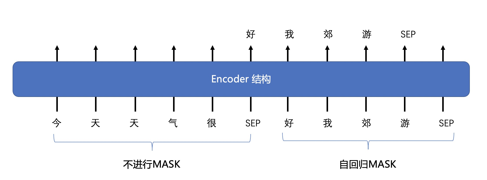

# 序列到序列生成方法

支持三种方式进行序列到序列任务的生成，包括
1. 只用Encoder模型进行序列到序列的生成任务 
2. 只用Decoder模型进行序列到序列的生成任务 
3. 用Encoder+Decoder模型进行序列到序列的生成任务。

## Encoder 模型
我们提供了encoder模型来执行seq2seq任务，例如，Bert、Roberta、GLM等等。

1. [使用RoBERTa模型进行标题生成](https://github.com/BAAI-Open/FlagAI/tree/master/examples/roberta_title_generation)
2. [使用GLM模型进行标题生成](https://github.com/BAAI-Open/FlagAI/tree/master/examples/glm_title_generation)
   
在训练过程中，我们在编码器模型中添加了一个特殊的 attention mask。(https://github.com/microsoft/unilm)

该模型的输入是两个句子：[cls]句子1[sep]句子2[sep]。
其中，句子_1不使用mask，而句子_2使用自回归mask。

## Decoder 模型
我们还为seq2seq任务提供了decoder模型，例如gpt-2模型。
1. [使用GPT-2模型进行文章续写](https://github.com/BAAI-Open/FlagAI/blob/master/quickstart/writing_ch.py)

给出一个起始文本，这个模型可以很好地延续文本。

## Encoder-Decoder 模型
我们还为seq2seq任务提供encoder-decoder模型，例如T5模型。
1. [使用T5模型进行标题生成](https://github.com/BAAI-Open/FlagAI/tree/master/examples/t5_title_generation)

encoder只需编码一次即可获得特征编码，decoder根据自身和特征编码继续生成。