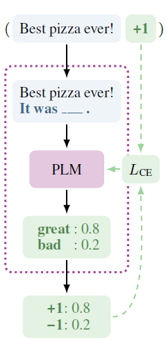

# 下游任务
高质量的预训练模型可以极大地增强各种NLP任务。
起初，研究人员只需添加一个分类层，就可以将预训练模型与下游任务的标签相匹配。

## 概要

## Pattern-Exploiting Training（PET）

正如 [Exploiting Cloze Questions for Few Shot Text Classification and Natural
Language Inference](https://arxiv.org/abs/2001.07676) 所提出，
PET可以将输入文本重建为完形填空式短语，这使得预先训练的模型更容易理解给定的任务。

由于不同任务之间输入文本和标签的设置不同，我们需要指定适当的完形填空风格模式。
本文介绍了一个情绪分类示例，如下所示。

给定的情绪分析任务是：给定输入上下文（例如'Best pizza ever!'）和
有限类别（这里有两个类别，1和-1分别表示积极和消极）。
我们的模型需要根据上下文自动预测每个情绪类别标签的概率。



如图所示，首先，正标签和负标签分别表示为“好”和“坏”。
然后，该模式被设计为： 上下文 + "它是" + mask情绪标签+ "."。
将“好”和“坏”填充到mask位置的概率将由finetune模型返回。

这里我们可以看到，它要求用户为每个给定任务设计一个pattern-verbalizer（PVP）。
在我们的项目中，这部分放在 easybigmodel/data/dataset/superglue/pvp中。
在给定任务的类下，通常存在两个名为“verbalize”和“get_parts”的函数，
它们代表verbalizer和模式设计步骤。
下面是一个例子,请注意，对于一个任务，可以有多种模式。
```
    def get_parts(self, example: InputExample) -> FilledPattern:

        text_a = self.shortenable(example.text_a)
        text_b = self.shortenable(example.text_b)

        if self.pattern_id == 0:
            return [[self.mask], ':', text_a, text_b], []
        elif self.pattern_id == 1:
            return [[self.mask], ' Question:', text_a, text_b], []
        elif self.pattern_id == 2:
            return [text_a, '(', [self.mask], ')', text_b], []
        elif self.pattern_id == 3:
            return [text_a, text_b, '(', [self.mask], ')'], []
        elif self.pattern_id == 4:
            return ['[ Category:', [self.mask], ']', text_a, text_b], []
        elif self.pattern_id == 5:
            return [[self.mask], '-', text_a, text_b], []
        else:
            raise ValueError("No pattern implemented for id {}".format(
                self.pattern_id))

    def verbalize(self, label) -> List[str]:
        return YahooPVP.VERBALIZER[label]
```