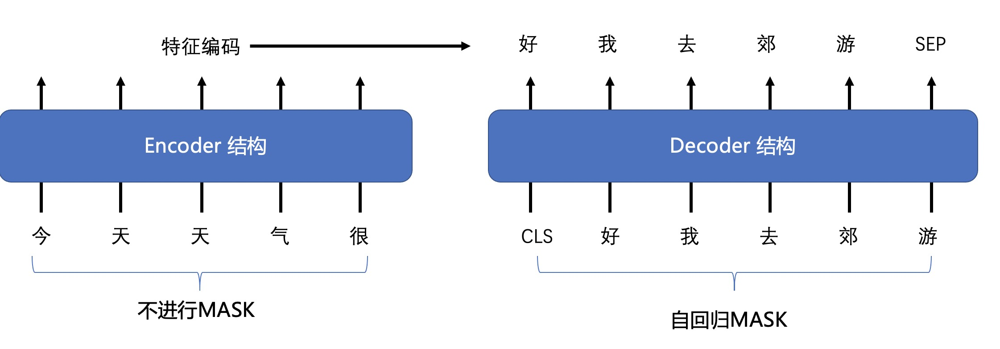

# Seq2seq Method

## Encoder model
We provide the encoder model to perform the seq2seq task, for example, Bert, Roberta, GLM, and so on.

We add a special attention mask in the encoder model at training process. (https://github.com/microsoft/unilm)

The inputs to this model are two sentences: [cls] sentence_1 [sep] sentence_2 [sep].

Where, sentence_1 does not use mask, and sentence_2 uses autoregressive mask.

## Decoder model

We also provide the decoder model for seq2seq task, such as gpt-2 models.

Giving a start text, this model can be a good continuation of the text.

## Encoder-Decoder model
We also provide the encoder-decoder model for seq2seq task, such as T5 models.

Encoder only needs to encode once to get features, decoder continues to generate according to self and encoder features.